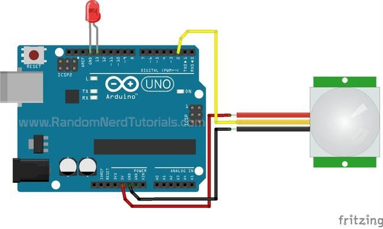
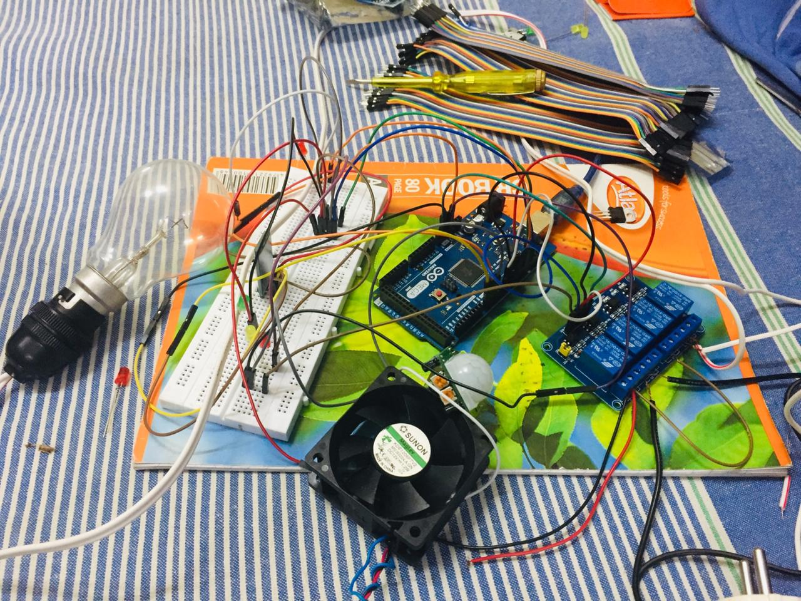
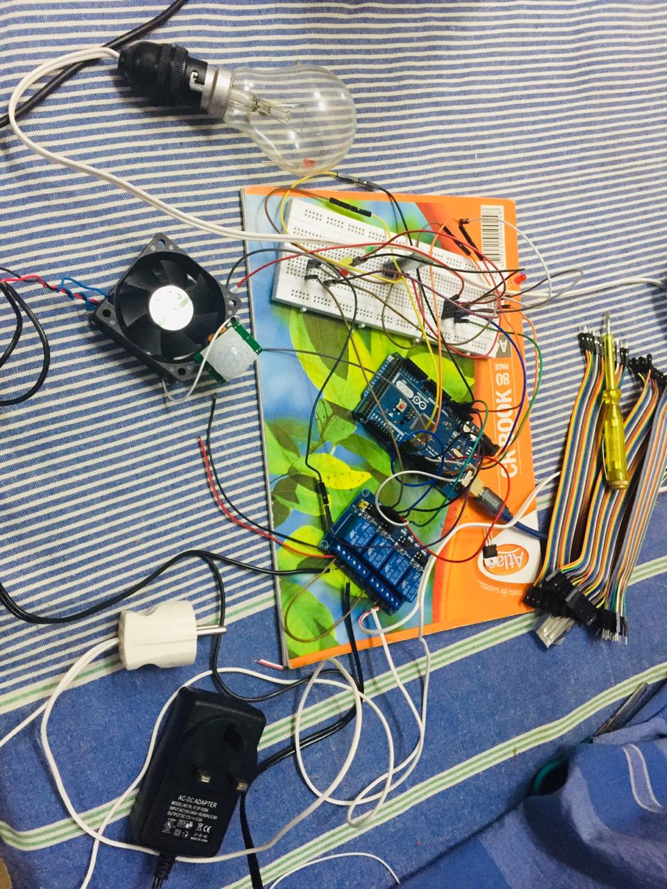
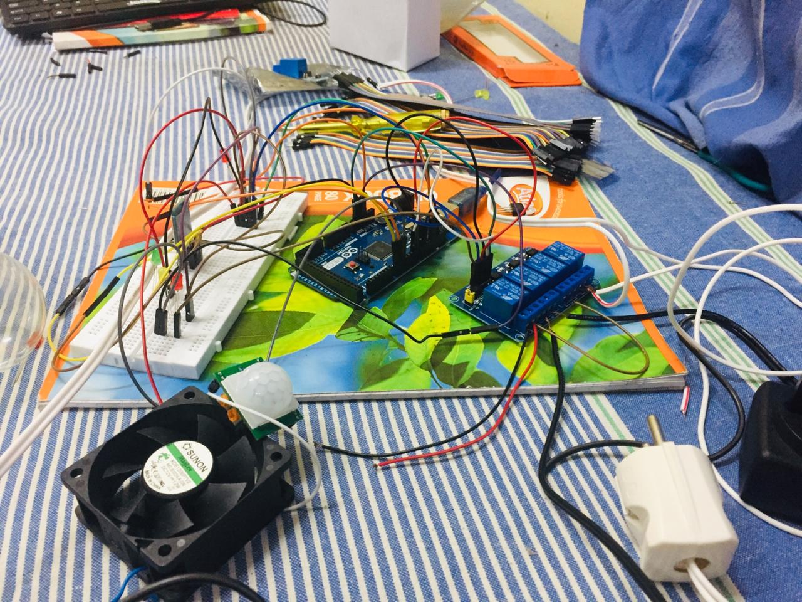

#             Android Home Automation System using Arduino

# Introduction

The main objective of this project is to develop a home automation system using an Arduino board with Bluetooth being remotely controlled by any Android OS smartphone. As technology is advancing so houses are also getting smarter. Modern houses are gradually shifting from conventional switches to centralized control system, involving remote controlled switches. Presently, conventional wall switches located in different parts of the house makes it difficult for the user to go near them to operate. Even more it becomes more difficult for the elderly or physically handicapped people to do so. Remote controlled home automation system provides a most modern solution with smartphones.

In order to achieve this, a Bluetooth module is interfaced to the Arduino board at the receiver end while on the transmitter end, an android application on the phone sends commands to the receiver where loads are connected.The loads can be turned ON/OFF remotely through this technology.

# Block Diagram

The Block Diagram for this project have mainly three block.

1.Bluetooth Module
2.Arduino Mega
3.Relay Board 4 channel

Bluetooth Module:The Bluetooth Module block is mainly responsible for establishing the connection between The Android Smart phone and the Circuit over Bluetooth Channel.

Arduino Mega:This block is the main part of our project which controls and co-ordinates all the other peripherals that are connected with the circuit.

Relay Board: Relay board is nothing, it is a Magnetic Switch. I am using a 4 channel relay board for this project to control different Appliances i.e the Led,fan(DC) and a ligh bulb(AC with 220V) .

# Componenets Required for this project:

# Hardware :

1. Arduino MegA.

2. Bluetooth Module Hc-06.

3. 4 channel relay: each 5V.

4. Prototype board or breadboard>

5. Connecting wires(Jumper Wires).
6. PIR Motion Sensor(For detecting Infrared radiation (IR) of humans to on and off the light)
7. 100W bulb (AC)
8. 12v fan   (DC)
9. Some Leds
10. Adapter 12v for the fan to get the power

# Software :

1.Arduino IDE : Arduino .

2.Android phone with Home Control Application

# Working of the System:

Arduino will get ready to receive commands once the Android App successfully paired with the Circuit over the bluetooth channel. Once a button is pressed a value will be sent(Eg:- "A") by the App and it will be received by the Circuit though the Bluetooth Module. The value received by the Bluetooth Module will be sent to the receive port of Arduino.
Arduino will check the Value received and it will Control the Realy according to that. 

This application controls the various appliances connected to your arduino and relays. When the toggle buttons on the application are pressed, corresponding bluetooth signals are sent from your android phone to the bluetooth module you have hooked up to your arduino. The arduino finds out which signal was sent and compares it to the predefined signals assigned for each appliance. When it identifies that signal, then the arduino activates the relay hooked up to its digital pin by passing 5V through it. Thus the relay is switched ON and the corresponding appliance connected to the relay is turned ON as well. To switch it OFF , arduino passes a 0V or logic low to its digital pin.

The Pir Motion sensor is connected to the arduino.Basically, the PIR motion sensor measures infrared light from objects in its field of view.

So, it can detect motion based on changes in infrared light in the environment. It is ideal to detect if a human has moved in or out of the sensor range.

Pinout
Wiring the PIR motion sensor to an Arduino is pretty straightforward – the sensor has only 3 pins.

  GND – connect to ground
  
  OUT – connect to an Arduino digital pin
  
  5V – connect to 5V

# Implementation:

  # Circuit Diagram:
  
  Connection of Arduiono Mega,4 channel relay and Bluetooth Hc-06 with help of jumper wires are as follow:
  
  
  Arduino Pin	            Relay Module            Bluetooth HC-06
  
  6 Arduino Pin	to  IN1( Input 1 ) of relay
  
  7	Arduino Pin	to  IN2( Input 2 ) of relay
  
  8	Arduino Pin	to  IN3( Input 3 ) of relay
  
  9	Arduino Pin	to  IN4( Input 4 ) of relay                    
  
  5V	Arduino Pin	to Vcc of relay
  
  Gnd Arduino Pin	to Gnd of relay
                    
                    
                     
 3.3v	Arduino Pin	to VCC of bluetooth
 
 Gnd	Arduino Pin	to Gnd of bluetooth
 
 Rx(pin 0)	Arduino Pin	to Tx of bluetooth                                 
 
 Tx(pin 1)	Arduino Pin	to Rx of bluetooth    
 
 
  
  
  
  
  
  
  
  
  
  
